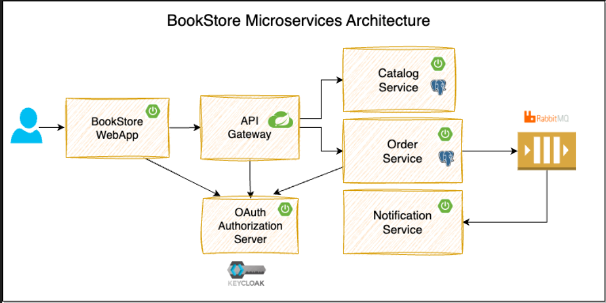

# Spring Boot Microservices Example


We will build a BookStore application using Spring Boot, Spring Cloud, and Docker.



> **⚠️ Note**: This project is under development. The following features will be added soon:
> - OAuth 2.0 Security using Spring Security and Keycloak
> - Observability using Actuator, Prometheus, Grafana, Loki and Tempo

## Modules

* **catalog-service**: 
  This services provides REST API for managing catalog of products(books).
  
  **TechStack:** Spring Boot, Spring Data JPA, PostgreSQL

* **order-service**: 
  This service provides the REST API for managing orders and publishes order events to the message broker.
  
  **TechStack:** Spring Boot, Spring Data JPA, PostgreSQL, RabbitMQ

* **notification-service**: 
  This service listens to the order events and sends notifications to the users.
  
  **TechStack:** Spring Boot, RabbitMQ

* **api-gateway**: 
  This service is an API Gateway to the internal backend services (catalog-service, order-service).
  
  **TechStack:** Spring Boot, Spring Cloud Gateway

* **bookstore-webapp**: 
  This is the customer facing web application where customers can browse the catalog, place orders, and view their order details.
  
  **TechStack:** Spring Boot, Thymeleaf, Alpine.js, Bootstrap

## Learning Objectives

* Building Spring Boot REST APIs
* Database Persistence using Spring Data JPA, Postgres, Flyway
* Event Driven Async Communication using RabbitMQ
* Implementing API Gateway using Spring Cloud Gateway
* Implementing Resiliency using Resilience4j
* Job Scheduling with ShedLock-based distributed Locking
* Using RestClient, Declarative HTTP Interfaces to invoke other APIs
* Creating Aggregated Swagger Documentation at API Gateway
* Local Development Setup using Docker, Docker Compose and Testcontainers
* Testing using JUnit 5, RestAssured, Testcontainers, Awaitility, WireMock
* Building Web Application using Thymeleaf, Alpine.js, Bootstrap

## Local Development Setup

* Install Java 21. Recommend using [SDKMAN](https://sdkman.io/) for [managing Java versions](https://youtu.be/ZywEiw3EO8A).
* Install [Docker Desktop](https://www.docker.com/products/docker-desktop/)
* Install [IntelliJ IDEA](https://www.jetbrains.com/idea) or any of your favorite IDE
* Install [Taskfile](https://taskfile.dev/) utility
* Install [Postman](https://www.postman.com/) or any REST Client

```shell
$ curl -s "https://get.sdkman.io" | bash
$ source "$HOME/.sdkman/bin/sdkman-init.sh"
$ sdk install java 24.0.1-tem
$ sdk install maven
$ brew install go-task
(or)
$ go install github.com/go-task/task/v3/cmd/task@latest
```

Verify the prerequisites

```shell
$ java -version
$ docker info
$ docker compose version
$ task --version
```

### How to run the application locally?

```shell
# Clone the repository: 
$ git clone https://github.com/jul1979/spring-boot-microservices-course.git
$ cd spring-boot-microservices-course
```

#### Option 1: Start the infra components using Docker Compose and run microservices from IDE

1. **Start all the required services such as PostgreSQL, RabbitMQ, etc.:** `$ task start_infra`

2. **Start individual microservices:**
   You can start individual microservices by running their respective main entrypoint classes from IDE: `ApiGatewayApplication`, `CatalogServiceApplication`, `OrderServiceApplication`, `NotificationServiceApplication`, `BookstoreWebappApplication`

3. **Access the application** at http://localhost:8080

* Catalog Service PostgreSQL DB: `jdbc:postgresql://localhost:15432/postgres` with credentials `postgres/postgres`
* Order Service PostgreSQL DB: `jdbc:postgresql://localhost:25433/postgres` with credentials `postgres/postgres`
* RabbitMQ: `http://localhost:15672` with credentials `guest/guest`
* MailHog: `http://localhost:8025`

#### Option 2: Working on individual microservices

Each microservice has Testcontainers based configuration to start the required services such as PostgreSQL, RabbitMQ, etc automatically.

You can start individual microservices by running their respective Test main entrypoint classes from IDE: `TestCatalogServiceApplication`, `TestOrderServiceApplication`, `TestNotificationServiceApplication`, `ApiGatewayApplication`, `BookstoreWebappApplication`.

#### Option 3: Run all the infra components and applications using Docker Compose

1. **Start all:** `$ task start`

2. **Access the application** at http://localhost:8080


                                          